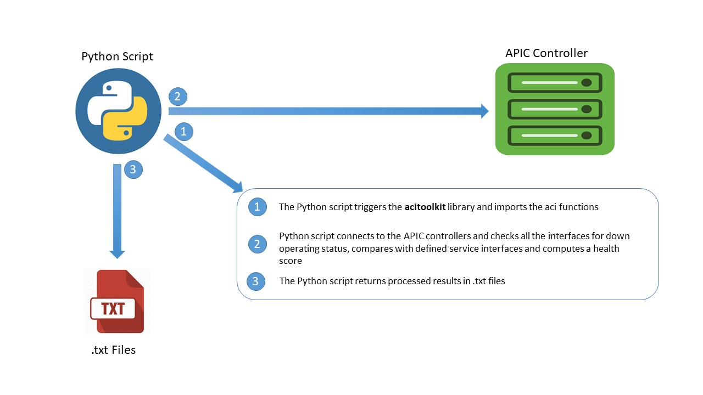
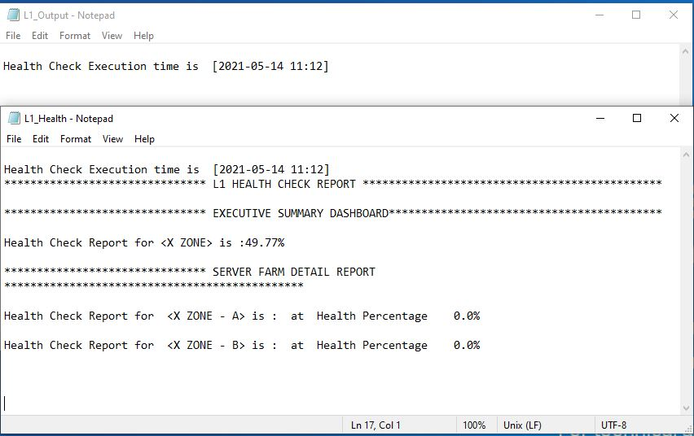

# ACI_LAYER1_CHECK
 Python Code that allows Network Engineers to run through their ACI Infrastructure for Layer 1 availability and compare to a set of interfaces that reflects their tenant computing a health score

## Overview

**Device/Interface Health**: 

The idea of the health check is to provide visibility into possible layer 1 problems within the network fabric. The script runs to check for interfaces that are down and compares them with expected set of interfaces and computes a health percentage score. 

**Python**

The script is written in python using acitoolkit to interact with APIC,and computation based on defined set of interfaces.

**Output**: The results of the CLI commands are stored in simple .txt file: (L1_Output.txt, L1_Health.txt) 

## Contacts
*Oluyemi Oshunkoya (yemi_o@outlook.com)

## Solution Components
*Python

## Prerequisites 

ACITOOLKIT
Python3.6 and above

## Installation

1. Clone this repository into your desired directory using the command:

git clone https://github.com/yzmar4real/ACI_LAYER1_CHECK.git

2. CD into the directory 

cd ACI_LAYER1_CHECK

3. Use the directory as a virtual environment for the project

python3 -m venv . 

4. Start the virtual environment and install the requirements for the project

source bin/activate

5. Setup ACITOOKIT and install the requirements below

git clone https://github.com/datacenter/acitoolkit.git

cd acitoolkit
python setup.py install

6. Execute the main script from console

python3 Main.py 
